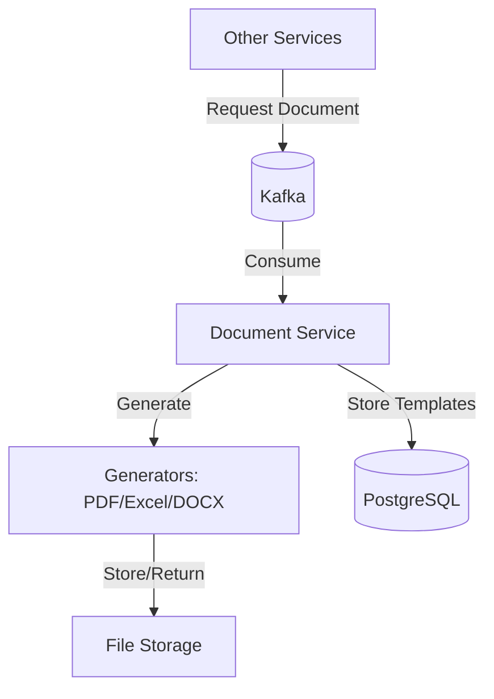

# Document Service

**Offeria — a product by [Al‑Wahha Al‑Sehriya](https://github.com/Al-Wahha-Al-Sehriya).**

[Company website](https://wahasehriya.com/) · [Offeria repositories](https://github.com/offeria-io)

## Description
The Document Service handles the generation and management of documents (PDF, Excel, DOCX) for the Offeria platform. It listens for document generation requests from Kafka and processes them using various document generators.

## Architecture Diagram


## File Structure
```text
document-service/
├── k8s/                  # Kubernetes manifests
├── src/
│   ├── main/
│   │   ├── java/offeria/document_service/
│   │   │   ├── config/      # Spring Configuration
│   │   │   ├── controller/  # REST endpoints
│   │   │   ├── dto/         # Request/Response data
│   │   │   ├── entity/      # Template entities
│   │   │   ├── exception/   # Custom exceptions
│   │   │   ├── kafka/       # Kafka consumers
│   │   │   ├── messaging/   # Common messaging logic
│   │   │   ├── repository/  # Data access layer
│   │   │   └── service/     # Business logic & Generators
│   │   └── resources/       # Configuration & Templates
│   └── test/                # Unit tests
├── Dockerfile           # Docker instructions
└── pom.xml              # Maven dependencies
```

## Technologies
- **Java 17**
- **Spring Boot 3**
- **Spring Data JPA**
- **Spring Kafka**
- **PostgreSQL**
- **Libraries**: iText/OpenPDF (PDF), Apache POI (Excel/DOCX)
- **Maven**

## Key Dependencies
- `spring-kafka`: Event-driven document processing.
- `spring-boot-starter-data-jpa`: Database interaction for templates.
- `spring-cloud-starter-netflix-eureka-client`: Discovery client.

## Environment Variables
- `SPRING_PROFILES_ACTIVE`: Active profile.
- `EUREKA_CLIENT_SERVICEURL_DEFAULTZONE`: Discovery Service URL.
- `DB_URL`: JDBC URL for PostgreSQL.
- `DB_USERNAME`: PostgreSQL username.
- `DB_PASSWORD`: PostgreSQL password.
- `KAFKA_SERVERS`: Kafka bootstrap servers.
